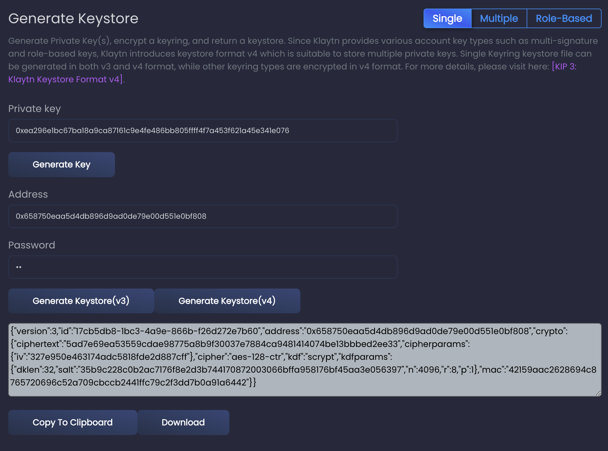

## Sending KLAY for Beginners <a id="sending-klay-at-a-glance"></a>

Let's try sending a transaction as a simple warm-up. In this short example, we will be creating a keystore, connecting to Klaytn node, as well as creating a transaction - all of this using caver-js!

Don't worry if this is your first time using caver-js. Just follow the simple steps below.

### Prerequisites

First install the following packages.
* [Node.js](https://nodejs.org/en/download/) version ([14.16.0](https://nodejs.org/dist/latest-v14.x/))
* [npm](https://www.npmjs.com/get-npm)
* [nvm](https://github.com/nvm-sh/nvm)
* [Solidity compiler](https://solidity.readthedocs.io/en/develop/installing-solidity.html)

*Note:* If you get an `nmv: command not found` error after installing nvm, refer to this [troubleshooting guide](https://github.com/nvm-sh/nvm/issues/2060).
 
### 1. Create an Account and Download Keystore <a id="1.-create-an-account-and-download-keystore"></a>
The most simple way to create an account is using the [Klaytn Online Toolkit](https://klaytn.github.io/klaytn-online-toolkit/misc/generateKeystore).



Download the keystore file, and let's change the name to something more simple, like `keystore.json`.

**You need KLAY to send a transaction.** You can get test KLAY for the Baobab testnet from [Faucet](https://baobab.wallet.klaytn.foundation/faucet). Refer to [Klaytn Wallet](../../../toolkit/klaytn-wallet.md#how-to-receive-baobab-testnet-klay) for detailed instructions.

### 2. Download caver-js <a id="2.-download-caver-js"></a>

First, let's create a folder for our project. We will simply call it `test`. Navigate to your command line and type:

```
mkdir test
```

Now let's navigate to our folder.

```
cd test
```

We are in our folder, where we will download caver-js. But before that, we have to check our `node.js` version, because we have to use 12 or 14. 

You can check the version like this:

```
node --version
```

If the version is not 12 or 14, **make sure to change it**. Here, we will use the version ([14.16.0](https://nodejs.org/dist/latest-v14.x/)). So let's type `nvm use 14.16.0` to change our node version.

And now we are ready to install caver-js.


```
npm install caver-js
```

Also, add the below module because we need it:

```
npm i read
```

### 3. Initialize Project <a id="3.-initialize-project"></a>

Now let's initialize our project:

```
npm init
```

Since we are just doing a simple test, it doesn't matter how you answer the questions. Keep pressing `Enter`.

```

package name: (test) 
version: (1.0.0) 
description: 
entry point: (index.js) 
test command: 
git repository: 
keywords: 
author: 
license: (ISC) 
About to write to /Users/terri.k/test/package.json:

{
  "name": "test",
  "version": "1.0.0",
  "description": "",
  "main": "index.js",
  "scripts": {
    "test": "echo \"Error: no test specified\" && exit 1"
  },
  "author": "",
  "license": "ISC"
}


Is this OK? (yes)
```

### 4. Create Test File <a id="4.-create-test-file"></a>

Let's create a test file named `testcaver.js` like so:

``` 
touch testcaver.js
```

We will be writing our code in this file to send a transaction to transfer KLAY.


### 5. Connect to Klaytn Node <a id="5.-connect-to-klaytn-node"></a> 

Since we are sending a transaction to the blockchain network, we need to connect to a Klaytn node. We will be using Klaytn's testnet Baobab.

We will import the `caver-js` and `read` module and connect to a Klaytn node in the Baobab network as shown below:

```javascript
const Caver = require('caver-js')
const read = require('read')
const caver = new Caver('https://api.baobab.klaytn.net:8651/')
```

### 6. Add Keystore, Create Keyring, and Add to Caver Wallet <a id="6.-add-keystore-create-keyring-and-add-to-caver-wallet"></a> 

You need an account to make transactions on the blockchain. That account information is included in the keystore. Using the `loadPassword()` function, which we will add later, you will be prompted to type the password on the terminal. It will be decrypted, and then stored as `keyring`.

After that, the `keyring` will be stored in the wallet. Add the lines below:

```
async function testFunction() {
// Read keystore json file
  const fs = require('fs')
	const keystore = fs.readFileSync('./keystore.json', 'utf8')
	const password = await loadPassword()

	// Decrypt keystore and create
	const keyring = caver.wallet.keyring.decrypt(keystore, 'password')
	console.log(keyring)

    // Add to caver.wallet
	caver.wallet.add(keyring)

	}
```

### 7. Send Transaction <a id="7.-send-transaction"></a> 

We will now create a trasaction to transfer some KLAY. This type of transaction is called "value transfer transaction". Let's break down each parameter.

The `from` address is derived from the keystore we uploaded. The `to` address is the receiver of the KLAY, and you can use any address. For `value`, you can conveniently use `caver.utils.toPeb()` to convert KLAY into peb. Here, we will send 10 KLAY. For `gas`, 

```
	
	// Create value transfer transaction
	const vt = caver.transaction.valueTransfer.create({
		from: keyring.address,
		to: '0x8084fed6b1847448c24692470fc3b2ed87f9eb47',
		value: caver.utils.toPeb(10, 'KLAY'),
		gas: 25000,
	})

	// Sign to the transaction
	const signed = await caver.wallet.sign(keyring.address, vt)

	// Send transaction to the Klaytn blockchain platform (Klaytn)
	const receipt = await caver.rpc.klay.sendRawTransaction(signed)
	console.log(receipt)
}
```
### 8. Load Password <a id="8.-load-password"></a> 

Add the below function, and you will be prompted to type your password on terminal. It will then be saved as `password`, which we have declared in step 6. 

```
async function loadPassword() {
    return new Promise((resolve, reject)=> {
        read({ prompt: 'Password: ', silent: true }, function(er, password) {
            if(er) {
                reject(er)
                return
            }
            resolve(password)
        })

    })

}
```

Don't forget to add in the end:

```
testFunction()
```

### 9. Run the Code <a id="8.-run-the-code"></a> 

Let's run the code that we've just written:

```
node testcaver.js
```


The result will look something like this:

```
SingleKeyring {
  _address: '0x658750eaa5d4db896d9ad0de79e00d551e0bf808',
  _key: PrivateKey {
    _privateKey: '0xea296e1bc67ba18a9ca87161c9e4fe486bb805ffff4f7a453f621a45e341e076'
  }
}
{
  blockHash: '0x0c29221072f049cf08ec2112755cbc0bc55289de5337faf2911147a4d8229693',
  blockNumber: '0x64e399d',
  contractAddress: null,
  effectiveGasPrice: '0x5d21dba00',
  from: '0x658750eaa5d4db896d9ad0de79e00d551e0bf808',
  gas: '0x61a8',
  gasPrice: '0xba43b7400',
  gasUsed: '0x5208',
  logs: [],
  logsBloom: '0x00000000000000000000000000000000000000000000000000000000000000000000000000000000000000000000000000000000000000000000000000000000000000000000000000000000000000000000000000000000000000000000000000000000000000000000000000000000000000000000000000000000000000000000000000000000000000000000000000000000000000000000000000000000000000000000000000000000000000000000000000000000000000000000000000000000000000000000000000000000000000000000000000000000000000000000000000000000000000000000000000000000000000000000000000000000',
  nonce: '0x0',
  senderTxHash: '0xdef371f3b194de1d6b6b678a3181e0e961549f2bc8f6391f97f48c8ea995225e',
  signatures: [
    {
      V: '0x7f6',
      R: '0x6425f98285f8e680a9cbfe32de824cceedd7fdca91ba9f7fa513898bc0d01ea8',
      S: '0x37718277df2a7a940212c9adb411f52d79d8cced784177c41224dca1a1ef122c'
    }
  ],
  status: '0x1',
  to: '0x7f1d6235b79688169fd6e15c4e8f540d6799dc75',
  transactionHash: '0xdef371f3b194de1d6b6b678a3181e0e961549f2bc8f6391f97f48c8ea995225e',
  transactionIndex: '0x2',
  type: 'TxTypeValueTransfer',
  typeInt: 8,
  value: '0x8ac7230489e80000'
}
```

You can view the transaction details in [Klaytnfinder](https://baobab.klaytnfinder.io/) or [Klaytnscope](https://scope.klaytn.com) using the `transactionHash`.

I hope you are feeling confident about having submitted a transacion using caver-js. If you are stuck, or have any questions, feel free to visit our [Klaytn Forum](https://forum.klaytn.foundation/) for help.