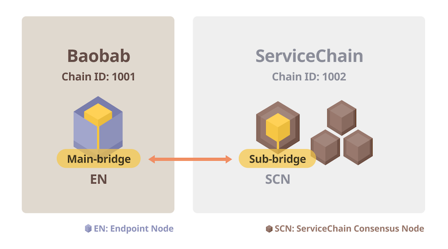
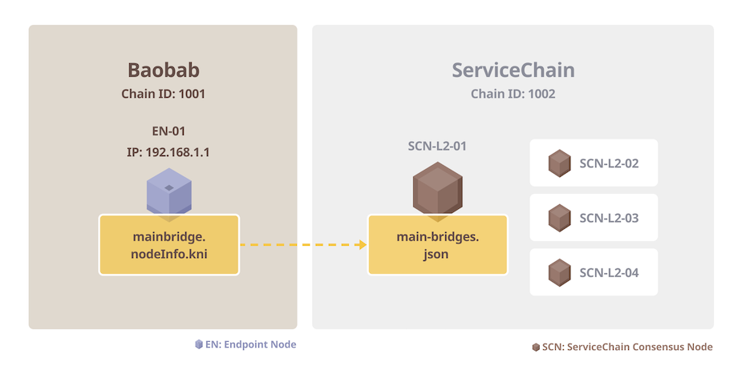
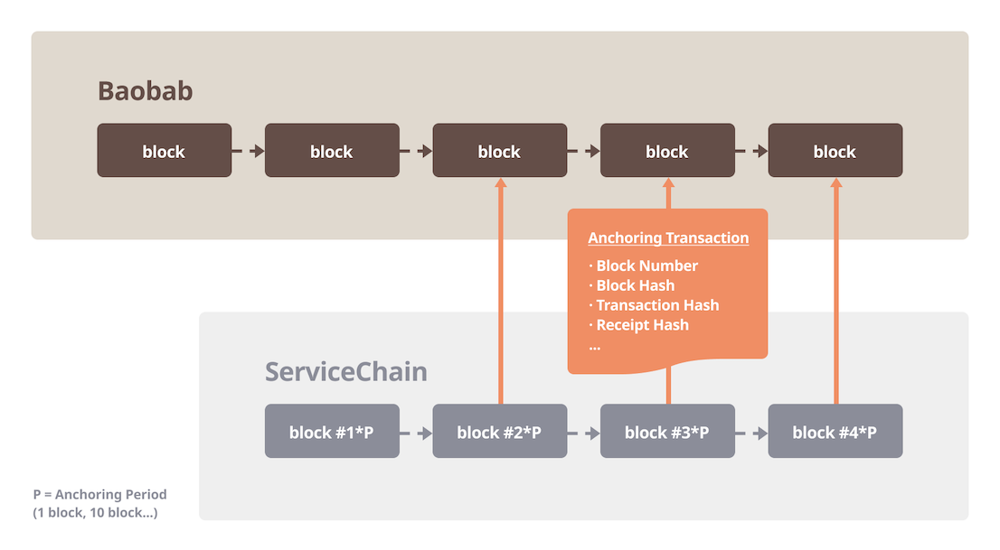

このセクションでは、4ノードのServiceChainネットワークをBaobabネットワークに接続する方法を説明します。 Baobab ENを設定し、ENをSCNのいずれかと接続します。 次に、アンカー機能を有効にして、ServiceChainブロック情報をBaobabネットワークに配置します。



## Prerequisites <a id="prerequisites"></a>
 - 1 Linux または MacOS サーバー for EN
 - テストのための最小ハードウェア要件
   - CPU: 4-core (Intel Xeon or equivalent), RAM: 16GB, HDD: 50GB
   - 詳細は [システム要件](../references/system-requirements.md) を参照してください。
 - Baobab EN 実行ファイルをダウンロードします。 ダウンロード可能なバイナリの完全なリストについては、 [ダウンロード](../../download/README.md) を参照してください。
 - 仮定と制限
   - ServiceChain ネットワークがインストールおよび実行されています。 ネットワークをセットアップするには、 [4ノードサービスチェーンの設定](4nodes-setup-guide.md) を参照してください。
   - バオバブEN。
   - 1つのENは1対1の接続しかサポートされていないため、1つのSCNにのみ接続できます。
   - すべてのSCNはENに接続する必要はありません。

## ステップ0: Baobab EN をインストール <a id="install-baobab-en"></a>
The installation is the uncompression of the downloaded package. ENサーバーでアーカイブを抽出します。

```bash
EN-01$ tar xvf ken-baobab-vX.X.X-XXXXX-amd64.tar.gz
```

## ステップ1：genesis.jsonの準備 <a id="step-1-preparing-genesis-json"></a>
ENサーバーから `genesis.json` を `Baobab` ネットワーク用にダウンロードします。
```
EN-01$ curl -X GET https://packages.klaytn.net/baobab/genesis.json -o ~/genesis.json
```

## ステップ 2: EN ノードの初期化 <a id="step-2-en-node-initialization"></a>
ここで、genesisファイルを使用してENノードを初期化します。 以下のコマンドを実行します。 It will create the data folder storing the chain data and logs on your home directory. You can change the data folder using the `--datadir` directive.

```
EN-01$ ken --datadir ~/data init ~/genesis.json
```

## ステップ 3: ENノードの設定 <a id="step-3-configure-the-en-node"></a>
kenインストールフォルダに移動し、 `mv kend_baobab.conf kend.conf`の名前を変更し、 `conf/kend.conf` を以下のように編集します。

```
...
NETWORK="バオバブ"
...
SC_MAIN_BRIDGE=1
...
DATA_DIR=~/data
...
```

## ステップ 4: ENノードを開始 <a id="step-4-start-the-en-node"></a>
```
EN-01$ kend start
Starting kscnd: OK
```
`klay.blockNumber` を見ることで、ブロック同期の状態を確認できます。 If this number is not 0, the node is working fine. Baobabネットワーク上のすべてのブロックをダウンロードするには、ネットワークの状態とハードウェアのパフォーマンスに応じて長い時間がかかることがあります。 ブロックを同期させるには、 [Fast Sync](../../node/endpoint-node/installation-guide/configuration.md) を使用することをお勧めします。
```
EN-01$ ken attach --datadir ~/data
> klay.blockNumber
21073
```
ノードを停止したい場合は、 `kend stop` コマンドを使用できます。

## ステップ 5: ENノードのKNIをチェックする <a id="step-5-check-kni-of-en-node"></a>
SCN-01ノードから接続するために使用される情報であるEN-01のKNIに注意してください。 この値は `main-bridges.json` を生成するときに次のステップで使用されます。
```
EN-01$ ken attach --datadir ~/data
> mainbridge.nodeInfo.kni
"kni://0f7aa6499553...25bae@[::]:50505?discport=0"
```



## ステップ 6: main-bridges.json を作成 <a id="step-6-create-main-bridges-json"></a>
SCN-L2-01(注:EN-01ノードではありません)にログオンし、 `~/data` に `main-bridges.json` を作成します。 Replace `[::]` located after `@` letter with EN-01 node's IP address.
```
SCN-L2-01$ echo '["kni://0f7aa6499553...25bae@192.168.1.1:50505?discport=0"]' > ~/data/main-bridges.json
```

## ステップ7：SCNを構成しkscnを再起動する <a id="step-7-configure-scn-then-restart-kscn"></a>
SCN-L2-01ノードのシェルから、 `kscn-XXXXX-amd64/conf/kscnd.conf` を編集します。 `SC_SUB_BRIDGE` が 1 に設定されている場合、SCN-L2-01 ノードの起動時にデータアンカーが自動的に開始されます。 この例では、 `SC_PARENT_CHAIN_ID` が 1001 に設定されています。親チェーンの `chainID` は 1001 であるためです。 `SC_ANCHORING_PERIOD` は、アンカーtxをメインチェーンに送信する期間を決定するパラメータである。 値を10に設定することで、10ブロックごとにアンカーを行うようにノードを構成します。 デフォルト値は 1 です。
```
...
SC_SUB_BRIDGE=1
...
SC_PARENT_CHAIN_ID=1001
...
SC_ANCHORING_PERIOD=10
...
```

以下のコマンドを実行して kscn を再起動します:
```
SCN-L2-01$ kscnd stop
Shuting down kscnd: Killed
SCN-L2-01$ kscnd start
Starting kscnd: OK
```

`subbridge.peers.length` をチェックして、SCN-L2-01がEN-01に接続されているかどうかを確認します。
```
SCN-L2-01$ kscn attach --datadir ~/data
> subbridge.peers.length
1
```

## アンカー  <a id="anchoring"></a>
EN-01とSCN-L2-01接続が終了したら、Anchoring経由で親チェーンのServiceChainブロック情報をログに記録できます。 このセクションでは、親演算子アカウントにチャージし、アンカーを有効にし、アンカーされたブロック番号を確認します。

### ステップ 1: KLAYを取得してアンカーをテストする <a id="step-1-get-klay-to-test-anchoring"></a>
アンカーは、バオバブにアンカー取引を行うためにSCN-L2-01を必要とします。 ですから、 `subbridge.parentOperator` のアカウントはトランザクション手数料を支払うのに十分な KLAYを持つ必要があります。 [Baobab Wallet Faucet](https://baobab.wallet.klaytn.foundation/) から KLAYを取得し、 `parentOperator` に転送します。 実際のサービスにおけるデータアンカーの場合、 `parentOperator` はトランザクション手数料として十分な KLAYを持つ必要があります。

```
SCN-L2-01$ kscn attach --datadir ~/data
> subbridge.parentOperator
"0x3ce216beeafc62d20547376396e89528e1d778ca"
```


### ステップ 2: アンカーを開始 <a id="step-2-start-anchoring"></a>
アンカーを開始するには、次のコマンドを実行します。
```
SCN-L2-01$ kscn attach --datadir ~/data
> subbridge.anchoring(true)
true
```
アンカー開始後、 `subbridge.latestAnkirdBlockNumber` を使用して、Baobabに固定されている最新のブロックを確認できます。 これは、ENがBaobabの最新のブロックをすでにフォローアップした後にのみ機能することに注意してください。 デフォルトでは、SCN-L2-01はアンカーがオンになっているブロックのすべてのブロックにアンカーを試行します。 `SC_ANCHORING_PERIOD` を変更することでアンカー期間を設定できます。 値が 10 に設定されている場合、ブロック番号が 10 の倍数の場合、ノードはアンカーを試みます。
```
SCN-L2-01$ kscn attach --datadir ~/data
> subbridge.latestAnkirdBlockNumber
100
```

