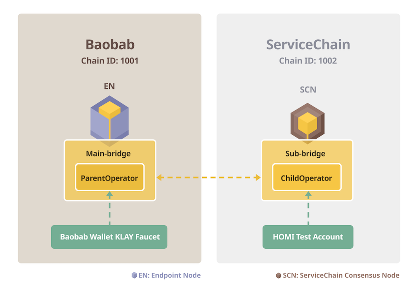

このセクションでは、提供されたテストコードを使用して Baobab ネットワークと ServiceChain 間のERC-20 値転送を有効にする方法を説明します。 オペレータアカウントにKLAYを追加し、ブリッジとERC-20契約を展開します。 その後、契約アドレスをSCNに登録します。 そして、ERC-20の転送値をテストします。


## 前提条件 <a id="prerequisites"></a>
- ServiceChainをインストールし、 [Connecting to Baobab](en-scn-connection.md) の指示によりServiceChainをBaobab ENに接続したと仮定します。
- リポジトリ [servicechain-value-transfer-examples](https://github.com/klaytn/servicechain-value-transfer-examples) をクローンします。
- `Node.js` (v14) と `npm` ([インストール方法](https://nodejs.org/en/download/package-manager/) ) をインストールします。
    - この例では、v14 をサポートする axios と caver-js の 2 つのパッケージを使用します。


## ERC-20 トークン転送（ワンステップ） <a id="erc-20-token-transfer-onestep"></a>

### ステップ1: KLAYをオペレータアカウントに追加します。 <a id="step-1-add-klay-to-the-operator-accounts"></a>
SCN に接続し、 `subbridge.parentOperator` と `subbridge.childOperator` を実行してアカウントアドレスを確認します。
```
$ kscn attach --datadir ~/data
> subbridge.childOperator
"0x10221f7f9355017cd0c1144e7eecb99621bacce"
> subbridge.parentOperator
"0x3ce216beeafc62d20547376396e89528e1d778ca"
```



`subbridge.parentOperator` と `subbridge.childOperator` はトランザクションを送信するのに十分な KLAYを持っている必要があります。 `subbridge.parentOperator` は Baobab ネットワークのアカウントであり、 `subbridge.childOperator` は ServiceChain ネットワークのアカウントであることに注意してください。 [Baobab Wallet](https://baobab.wallet.klaytn.foundation/) にテストアカウントを作成し、蛇口からKLAYテストを受けます。 次に、KLAYを `parentOperator` に送ってください。 `childOperator` は `homi` によって生成されたテストアカウントから KLAYを取得する必要があります([ENセットアップとSCN接続ガイド](en-scn-connection.md)を参照)。

```
$ kscn account import ~/homi-output/keys_testkey1
新しいアカウントはパスワードでロックされています。 パスワードを入力してください。 このパスワードを忘れないでください。
Passphrase:
Repeat passphrase:
Address: {80119c31cdae67c42c8296929bb4f89b2a52cec4}
```
```
$ kscn attach --datadir ~/data
> personal.unlockAccount("80119c31cdae67c42c8296929bb4f89b2a52cec4")
Unlock account 80119c31cdae67c42c8296929bb4f89b2a52cec4
Passphrase:
True
> klay.sendTransaction({from:"80119c31cdae67c42c8296929bb4f89b2a52cec4", to:subbridge.childOperator, value: web3.toPeb(1000, "KLAY")})
"0x84caab84ebf0c4bb4ecf0a7849f1de3e479f1863a95f70c51047a7ca7bc64b33"
```
オペレーターアカウントの残高が十分かどうかを確認します。 サブブリッジがインストールされている SCN ノードのコンソールから次のように問い合わせることができます。
```
> klay.getBalance(subbridge.childOperator)
1e+21
> subbridge.childOperatorBalance
1e+21
> subbridge.parentOperatorBalance
1e+18
```

### ステップ 2: コントラクトの導入 <a id="step-2-deploy-contracts"></a>
- SCNに接続し、コントラクト展開用のノード環境を準備します。 リポジトリ [servicechain-value-transfer-examples](https://github.com/klaytn/servicechain-value-transfer-examples) をクローンします。


このステップでは、ブリッジコントラクトとトークンコントラクトの両方を親と子チェーンにデプロイします。 トークンコントラクトはミント/トランスファーテスト用であり、ブリッジコントラクトは値の転送リクエストを聞く/処理するために使用されます。

```bash
$ git clone https://github.com/klaytn/servicechain-value-transfer-examples
$ cd servicechain-value-transfer-examples
$ npm install
$ cd erc20
```

テキストエディタで、 `bridge_info.json` を以下のように編集します。
- Replace `url` in the `child` section (SCN node on ServiceChain network) with your SCN node IP and the proper port number from `RPC_PORT` in `kscnd.conf`.
- `homi` によって生成された `testkey1` に `child.key` を置き換えます。
- `child.operator` を前のステップで調べた `subbridge.childOperator` アドレスに設定します。
- Replace `url` in the `parent` section (EN node on Baobab network) with your EN node IP and the proper port number from `RPC_PORT` in `kend.conf`.
- `parent.key` を、前のステップで [Baobab Wallet](https://baobab.wallet.klaytn.foundation/) から作成されたテストアカウントの秘密鍵に置き換えます。
- `parent.operator` を前のステップの `subbridge.parentOperator` として設定します。

```
{
     "child" : {
         "url": "http://192.168.0.1:7551",
         "key": "0x66cb283353589a10866b58d388e9d956e5a9c873a8c78fa4411d460c19c494ea",
         "operator": "0x10221f7f9355017cd0c11444e7eecb99621bacce"
     },
     "parent" : {
         "url": "http://192.168.0.5:8551",
         "key": "0x26f4b5ac42ceabcfd3b23a991fdbfc792d10ce700a99582fdf9185a8f163b790",
         "operator": "0x3ce216beeafc62d20547376396e89528e1d778ca"
     }
 }
```

コマンド `ノード erc20-deploy.js` を実行してトークンのデプロイを実行します。 このスクリプトはブリッジコントラクトとトークンコントラクトの両方をデプロイし、ブリッジペアを初期化するために API の使用法を出力します。
```
$ node erc20-deploy.js
------------------------- erc20-deploy START -------------------------
> info.bridge: 0xEa024d8101E112330f2d7B1a7e7932034E206721
> info.token: 0xbE641028610F628835C36F12bE62d54d74308D70
> info.bridge: 0xA5af6Ffe13b367626B5AdF827DdE7438E3Db4463
> info.token: 0x52F8Fa79Fa6D37b18b7AC8f9Ca835373f3C9270f
> subbridge.registerBridge("0xEa024d8101E112330f2d7B1a7e7932034E206721", "0xA5af6Ffe13b367626B5AdF827DdE7438E3Db4463")
> subbridge.subscribeBridge("0xEa024d8101E112330f2d7B1a7e7932034E206721", "0xA5af6Ffe13b367626B5AdF827DdE7438E3Db4463")
> subbridge.registerToken("0xEa024d8101E112330f2d7B1a7e7932034E206721", "0xA5af6Ffe13b367626B5AdF827DdE7438E3Db4463", "0xbE641028610F628835C36F12bE62d54d74308D70", "0x52F8Fa79Fa6D37b18b7AC8f9Ca835373f3C9270f")
------------------------- erc20-deploy END -------------------------
```

### ステップ 3: トークン転送 <a id="step-3-token-transfer"></a>


コマンド `ノード erc20-transfer-1step.js` を使用してトークン転送を実行します。 このワンステップのトークン転送には、ERC-20トークン実装の変更が必要です。 トークンコントラクトを変更したくない場合、またはすでにデプロイされているトークンコントラクトがある場合。 [ERC-20 トークン転送 (2ステップ)](#erc-20-token-transfer-twostep) をご覧ください。

```
$ node erc20-transfer-1step.js
-----------------------------------------------------------------
alice balance: 0
requestValueTransfer..
alice balance: 100
------------------------------------- erc20-transfer-1step END
```

結果が `alice balance: 100`の場合は、正常に実行されます。

## ERC-20 トークン転送 (2ステップ) <a id="erc-20-token-transfer-twostep"></a>
2ステップ転送例については、erc20-transfer-2step.jsを実行してください。 この2ステップのトークン転送例では、変更されていないERC-20トークンコントラクトを使用できます。 2 段階の転送は、2 つの関数呼び出しで構成されています: (1) ブリッジコントラクトを最初に承認し、(2) contract 関数 `requestERC20Transfer()` を呼び出します。 既にブリッジとトークンの両方のコントラクトを展開しているので、このセクションではコントラクトを展開しません。 デプロイしなかった場合は、最初にデプロイする必要があります。 `ノード erc20-deploy.js` を使用してコントラクトをデプロイできます。
```
$ node erc20-transfer-2step.js
> ----------------------------- erc20-transfer-2step START ----------------------
> alice balance: 100
> requestValueTransfer..
> alice balance: 200
----------------------------------------- erc20-transfer-2step END
```


## ERC-20インターフェース経由でKIP-7トークン転送 (2ステップ) <a id="kip-7-token-transfer-via-erc-20-interface-two-step"></a>
[KIP-7](https://kips.klaytn.foundation/KIPs/kip-7) は ERC-20 と互換性のあるトークン規格です。 KIP-7 トークンコントラクトに `requestERC20Transfer()` 関数を呼び出して、親チェーンと子チェーン間で KIP-7 トークンを転送できます。 ERC-20インターフェース経由でKIP-7トークンを送信する場合。 `approve()` 関数を呼び出し、ブリッジがトランザクション送信者に代わってトークンを送信できるようにします。 次に、 `requestERC20Transfer()` 関数を呼び出します。 以下のコマンドはブリッジコントラクトと KIP-7 コントラクトをデプロイします。
```
$ node kip7-deploy.js
> ------------------------- kip7-deploy START -------------------------
> info.bridge: 0x04e929Cd2A08acd28a210369407D8Ca237Edd8FE
> info.token: 0xE0E2fC6C7d1eB069153E0c12a4C87B01586b39e7
> info.bridge: 0xEb502159A4B4E876B1cb423f250DCC0d276e01b6
> info.token: 0xd4f02Ca1d49674056A9ec78fbBDc9e1e97726A4F
> subbridge.registerBridge("0x04e929Cd2A08acd28a210369407D8Ca237Edd8FE", "0xEb502159A4B4E876B1cb423f250DCC0d276e01b6")
> subbridge.subscribeBridge("0x04e929Cd2A08acd28a210369407D8Ca237Edd8FE", "0xEb502159A4B4E876B1cb423f250DCC0d276e01b6")
> subbridge.registerToken("0x04e929Cd2A08acd28a210369407D8Ca237Edd8FE", "0xEb502159A4B4E876B1cb423f250DCC0d276e01b6", "0xE0E2fC6C7d1eB069153E0c12a4C87B01586b39e7", "0xd4f02Ca1d49674056A9ec78fbBDc9e1e97726A4F")
------------------------- kip7-deploy END -------------------------
```
以下のコマンドは、 `requestERC20Transfer()` を使用して ERC-20 インターフェイスを使用して KIP-7 トークンを送信する例です。

```
$ node kip7-transfer-2step-erc20-interface.js
> -----------------------------------------------------------------
> alice balance: 0
> requestValueTransfer..
> alice balance: 100
> ----------------------------------------- kip7-transfer-2step-erc20-interface END
```

その他の場合は [service-chain-value-transfer-example](https://github.com/klaytn/servicechain-value-transfer-examples) を参照してください。

## KIP-7とKIP-17のネイティブサポート (実装する) <a id="native-support-for-kip-7-and-kip-17-to-be-implemented"></a>
現在、Klaytnチームが提供するブリッジコントラクトは、トークン転送のために `requestERC20Transfer()` と `requestERC721Transfer()` のみをサポートしています。 対応する KIP-7 と KIP-17 のリクエスト関数は、まもなくサポートされる予定です。 実装が完了する前に、上記のように、ERC-20インターフェースを使用してKIP-7トークンを転送できます。

## ERC-721、KIP-17、KLAYの値転送 <a id="value-transfer-for-erc721-kip17-and-klay"></a>
ERC-721、KIP-17、KLAYのワークフローは上記と同じです。 [`erc721`](https://github.com/klaytn/servicechain-value-transfer-examples/tree/master/erc721), [`kip17`](https://github.com/klaytn/servicechain-value-transfer-examples/tree/master/kip17), and [`klay`](https://github.com/klaytn/servicechain-value-transfer-examples/tree/master/klay) ディレクトリには対応するソースコード例が含まれています。
